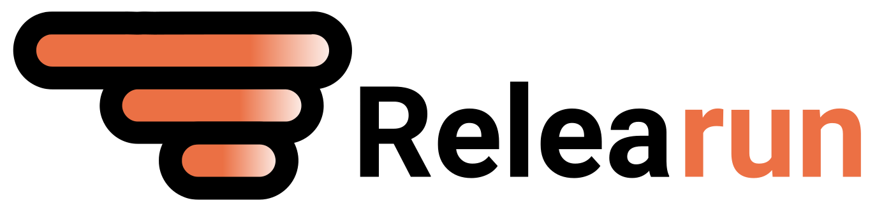

<div>
    
</div>

ReleaRun s'occupe de la gestion des versions applicatives. L'objectif est d'avoir une vision globale des versions deployées sur les envirronements.

## ⭐ Features

[](https://app.codacy.com/gh/bfoujols/relearun?utm_source=github.com&utm_medium=referral&utm_content=bfoujols/relearun&utm_campaign=Badge_Grade_Settings)

* Push version
* Gestion des versions
* Authentification token
* Addons chrome

## 🔧 Installation
```
# installation fichier d'envirronnement
cp _.env.exempl .env
# installation des packages
composer install
# installation de la base de donnée
php bin/console doctrine:migration:migrate
```

### Author 
- Benoit Foujols 
- Noa Sillam 
- Athittyan Balagowriyan

### MIT License